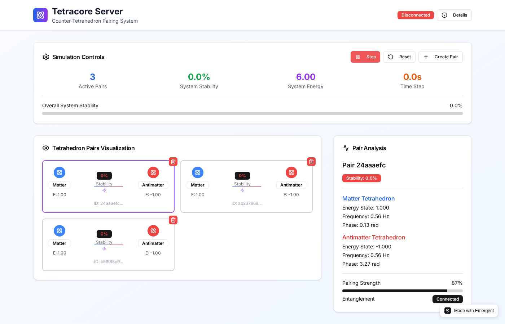

# Tetracore Server Simulation

<div align="center">


**Counter-Tetrahedron Pairing System Simulation**

*Berdasarkan Teori Methane Metauniverse (MMU)*

[](https://python.org)
[](https://reactjs.org)
[](https://fastapi.tiangolo.com)
[](https://mongodb.com)
[](LICENSE)

[Demo Live](https://tetra-universe.preview.emergentagent.com) • [Dokumentasi](INSTALL.md) • [Paper MMU](https://osf.io/mk3xr/)

</div>

## 🌌 Tentang Proyek

**Tetracore Server Simulation** adalah implementasi interaktif dari teori **Methane Metauniverse (MMU)** yang dikembangkan oleh Jürgen Wollbold. Aplikasi ini mensimulasikan sistem stabilisasi **Counter-Tetrahedron Pairing** di mana realitas dimodelkan sebagai struktur geometris yang terdiri dari tetrahedron.

### 🔬 Dasar Ilmiah

Berdasarkan paper penelitian:
- **Judul**: "The Methane Metauniverse (MMU) A Geometric Explanation of Antiparticles, Entanglement, and Time"
- **Penulis**: Jürgen Wollbold  
- **DOI**: [10.17605/OSF.IO/MK3XR](https://osf.io/mk3xr/)
- **Tanggal**: August 2025

### 🎯 Konsep Utama

- **Geometric Reality**: Alam semesta sebagai lattice fraktal dari tetrahedra
- **Four-Dimensional Nodes**: Setiap node menghubungkan 4 arah (w₁: projection, w₂: energy, w₃: spin, w₄: mass)
- **Counter-Tetrahedron**: Setiap partikel memiliki pasangan cermin untuk stabilisasi
- **Quantum Entanglement**: Koneksi fisik antara nodes yang dibuat bersamaan
- **Time as Oscillation**: Waktu sebagai hasil proyeksi osilasi internal

## ✨ Fitur Utama

### 🔧 Physics Engine
- **Tetrahedron Pair Management**: Sistem manajemen pasangan matter-antimatter
- **Real-time Oscillations**: Simulasi getaran tetrahedron dengan frequency dan phase
- **Stability Calculations**: Kalkulasi faktor stabilitas berdasarkan jarak, energi, dan sinkronisasi fase
- **System Metrics**: Monitoring stabilitas sistem dan energi total

### 🎨 Interactive Interface  
- **3D Visualization**: Visualisasi interaktif pasangan tetrahedron
- **Real-time Dashboard**: Panel kontrol untuk simulasi dan monitoring
- **Detailed Analysis**: Panel analisis detail untuk setiap pasangan
- **Professional UI**: Desain modern dengan Tailwind CSS dan animasi

### 🚀 Technical Stack
- **Backend**: FastAPI (Python) dengan MongoDB
- **Frontend**: React dengan shadcn/ui components
- **Real-time**: WebSocket untuk update langsung
- **Styling**: Tailwind CSS dengan custom animations

## 🖼️ Screenshots

<div align="center">

### Main Interface


### Tetrahedron Pairs Visualization  


### Detailed Analysis Panel


### Real-time Simulation


</div>

## 🚀 Quick Start

### Prerequisites
- Python 3.8+
- Node.js 16+
- MongoDB 4.4+
- Yarn package manager

### Installation

1. **Clone Repository**
   ```bash
   git clone https://github.com/your-username/tetracore-server.git
   cd tetracore-server
   ```

2. **Setup Backend**
   ```bash
   cd backend
   pip install -r requirements.txt
   cp .env.example .env
   python server.py
   ```

3. **Setup Frontend**
   ```bash
   cd frontend
   yarn install
   cp .env.example .env
   yarn start
   ```

4. **Access Application**
   - Frontend: http://localhost:3000
   - Backend API: http://localhost:8001

📖 **Untuk instalasi lengkap, lihat [INSTALL.md](INSTALL.md)**

## 🎮 Cara Penggunaan

### 1. Membuat Tetrahedron Pairs
- Klik tombol **"Create Pair"** untuk membuat pasangan matter-antimatter baru
- Setiap pair terdiri dari tetrahedron matter (biru) dan antimatter (merah)
- Pair akan muncul dengan indikator stabilitas dan koneksi entanglement

### 2. Menjalankan Simulasi
- Klik **"Start"** untuk memulai simulasi osilasi real-time
- Amati perubahan energy state, frequency, dan phase
- Monitor system stability dan total energy

### 3. Analisis Detail
- Klik pada pair tetrahedron untuk melihat analysis panel
- Lihat detail physics parameters:
  - Energy state matter dan antimatter
  - Oscillation frequency dan phase
  - Pairing strength dan entanglement status

### 4. Management System
- **Delete**: Hapus pair individual dengan tombol (X)
- **Reset**: Reset seluruh simulasi dan hapus semua pairs
- **Monitor**: Pantau metrics sistem secara real-time

## 🔌 API Documentation

### Simulation Control
```http
POST /api/simulation/start    # Start simulasi
POST /api/simulation/stop     # Stop simulasi  
POST /api/simulation/reset    # Reset simulasi
GET  /api/simulation/state    # Get current state
```

### Tetrahedron Pairs
```http
GET    /api/pairs             # Get all pairs
POST   /api/pairs/create      # Create new pair
GET    /api/pairs/{id}        # Get specific pair
DELETE /api/pairs/{id}        # Delete pair
```

### Real-time Updates
```http
WS /api/ws                    # WebSocket untuk updates real-time
```

## 🧮 Physics Implementation

### Tetrahedron Geometry
```python
# Regular tetrahedron vertices dalam unit form
vertices_coords = [
    (1, 1, 1), (1, -1, -1), (-1, 1, -1), (-1, -1, 1)
]
```

### Stability Calculation
```python
def calculate_pair_stability(pair):
    distance_factor = 1.0 / (1.0 + abs(distance - optimal_distance))
    energy_balance = 1.0 - abs(matter.energy + antimatter.energy) / 2.0
    phase_sync = (1.0 + cos(matter.phase - antimatter.phase)) / 2.0
    
    return distance_factor * energy_balance * phase_sync
```

### Oscillation Update
```python
def update_oscillations(dt):
    matter.phase += matter.oscillation_frequency * dt
    matter.energy_state = 1.0 + 0.3 * sin(matter.phase)
    
    antimatter.phase += antimatter.oscillation_frequency * dt  
    antimatter.energy_state = -(1.0 + 0.3 * sin(antimatter.phase))
```

## 🏗️ Architecture

```
tetracore-server/
├── backend/                 # FastAPI server
│   ├── server.py           # Main application
│   ├── requirements.txt    # Python dependencies
│   └── .env               # Environment variables
├── frontend/               # React application  
│   ├── src/
│   │   ├── App.js         # Main component
│   │   ├── App.css        # Styling
│   │   └── components/    # UI components
│   ├── package.json       # Node dependencies
│   └── .env              # Environment variables
├── docs/                  # Documentation
├── INSTALL.md            # Installation guide
└── README.md             # This file
```

## 🌟 Scientific Accuracy

### Methane Metauniverse Theory Implementation
- ✅ **Tetrahedron Lattice**: Geometric structure sebagai basis reality
- ✅ **Four-Dimensional Nodes**: w₁, w₂, w₃, w₄ parameters
- ✅ **Matter-Antimatter Pairs**: Counter-tetrahedron stabilization  
- ✅ **Quantum Entanglement**: Physical connections antara paired nodes
- ✅ **Time Oscillation**: Internal vibrations sebagai projected time

### Physics Calculations
- ✅ **Distance-based Stability**: Optimal distance calculations
- ✅ **Energy Balance**: Matter-antimatter energy compensation
- ✅ **Phase Synchronization**: Oscillation phase relationships
- ✅ **System Metrics**: Overall stability dan energy tracking

## 🤝 Contributing

Kami menyambut kontribusi untuk pengembangan simulasi ini:

1. **Fork** repository
2. **Create** feature branch (`git checkout -b feature/amazing-feature`)
3. **Commit** changes (`git commit -m 'Add amazing feature'`)
4. **Push** ke branch (`git push origin feature/amazing-feature`)
5. **Open** Pull Request

## 📚 References

1. Wollbold, J. (2025). "The Methane Metauniverse (MMU) A Geometric Explanation of Antiparticles, Entanglement, and Time." OSF. DOI: 10.17605/OSF.IO/MK3XR

2. [FastAPI Documentation](https://fastapi.tiangolo.com/)

3. [React Documentation](https://reactjs.org/docs/)

4. [MongoDB Documentation](https://docs.mongodb.com/)

## 📄 License

Project ini dilisensikan di bawah MIT License.

---

<div align="center">

**🌌 Advancing Theoretical Physics Through Interactive Simulation 🌌**

Made with ❤️ for the scientific community

</div>
